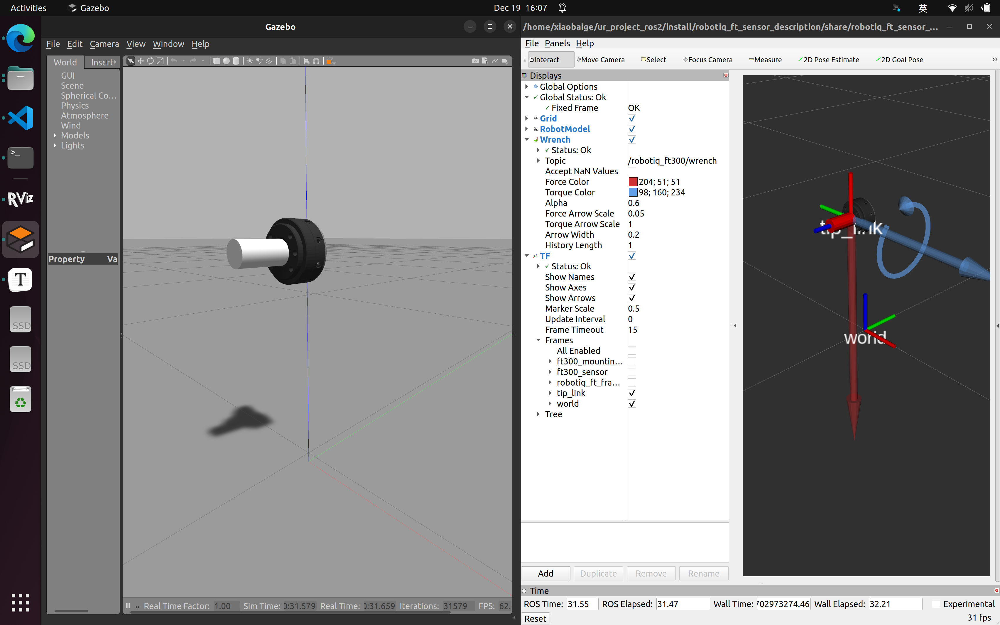

# ros2_robotiq_ft_sensor
ROS2 package for robotiq ft sensor. This repo also provides a method of using force and torque sensor in Gazebo classic and ROS2. 

This package is **ONLY** for **Gazebo simulation**. 

## Environment and dependences

* ROS2 Humble
* [gazebo_ros_pkgs](https://github.com/ros-simulation/gazebo_ros_pkgs), you can download it by apt: `sudo apt install ros-humble-gazebo-ros-pkgs`

## Launch the example

Git clone this package to your workspace and build: 

```shell
mkdir -p ~/ros2_ws/src
cd ~/ros2_ws/src
git clone git@github.com:zitongbai/ros2_robotiq_ft_sensor.git
cd ~/ros2_ws
colcon build --symlink-install
```

Launch the file and you would expect to see the gazebo and rviz with wrench arrow visualized. 

```shell
ros2 launch robotiq_ft_sensor_description robotiq_ft_sensor.launch.py
```



## Some tips for using gazebo ft sensor via ROS2

:warning: Make sure that the parent link and child link of the joint you attach sensor to **has inertial**, otherwise something wrong may happen. 

Here is the tips from `gazebo_ros_ft_sensor.hpp` (you can find it in your ROS2 install path, e.g. `/opt/ros/humble/include/gazebo_plugins`): 

```cpp
/// This is a controller that simulates a 6 dof force and torque sensor on link or joint.
/// For joints, the wrench is reported in the joint child link frame and the
/// measure direction is child-to-parent link. (Force and Torque Feed Back Ground Truth)
/// If <body_name> is specified, the plugin acts as sensor on a link, otherwise if
/// <joint_name> is specified, it acts as a sensor on a joint
/*
 * \author  John Hsu
 * \author Francisco Suarez-Ruiz
 */
/**
  Example Usage:
  \code{.xml}
    <plugin name="gazebo_ros_ft_sensor" filename="libgazebo_ros_ft_sensor.so">

      <ros>

        <!-- Add a namespace -->
        <namespace>/demo</namespace>

        <!-- Remap the default topic -->
        <remapping>wrench:=wrench_demo</remapping>

      </ros>

      <!-- Link name -->
      <body_name>link</body_name>

      <!-- Set frame id of published message. Used only when sensor used on links -->
      <frame_name>demo_world</frame_name>

      <!-- Update rate in Hz, defaults to 0.0, which means as fast as possible -->
      <update_rate>1</update_rate>

      <!-- Standard deviation of the noise to be added to the reported wrench messages. -->
      <gaussian_noise>0.01</gaussian_noise>

    </plugin>
  \endcode
*/
```

the above tips use sensor on link, my example use sensor on joint: 

```xml
<gazebo reference="${prefix}ft300_sensor_joint">
    <disableFixedJointLumping>true</disableFixedJointLumping>
    <provideFeedback>true</provideFeedback>
</gazebo>
<!-- gazebo plugin for ft sensor 
    This is a controller that simulates a 6 dof force and torque sensor on link or joint.
    For joints, the wrench is reported in the joint child link frame and the
    measure direction is child-to-parent link. (Force and Torque Feed Back Ground Truth)
    If <body_name> is specified, the plugin acts as sensor on a link, otherwise if
    <joint_name> is specified, it acts as a sensor on a joint -->
<gazebo>
    <plugin name="${prefix}gazebo_ros_ft_sensor" filename="libgazebo_ros_ft_sensor.so">
        <ros>
            <!-- Add a namespace -->
            <namespace>/${prefix}robotiq_ft300</namespace>
            <!-- Remap the default topic -->
            <!-- <remapping>wrench:=wrench_demo</remapping> -->
        </ros>
        <!-- Joint name -->
        <joint_name>${prefix}ft300_sensor_joint</joint_name>
        <!-- Update rate in Hz, defaults to 0.0, which means as fast as possible -->
        <update_rate>50</update_rate>
        <!-- Standard deviation of the noise to be added to the reported wrench messages. -->
        <gaussian_noise>0.01</gaussian_noise>
    </plugin>
</gazebo>
```


